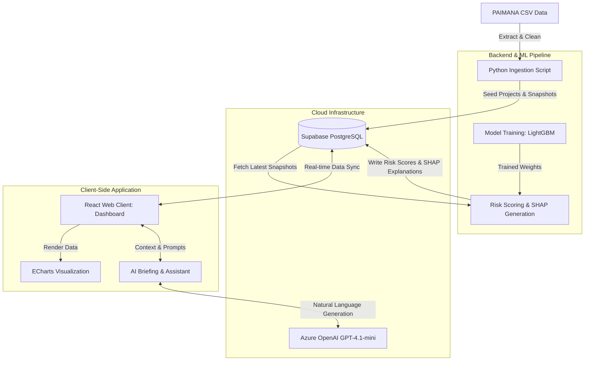

# ProjectSaarthi AI 🚀

> **"From Monitoring Projects to Predicting Problems."**


[](https://github.com/inxane-rudrakxh/project-saarthi)

**ProjectSaarthi AI** is an AI-powered predictive and prescriptive early-warning and decision-support system designed to monitor and evaluate major Central Sector Infrastructure Projects.

Developed to evolve the traditional infrastructure tracking paradigm, this platform moves beyond descriptive analytics (*"What happened?"*) into predictive (*"What is likely to happen?"*) and prescriptive analytics (*"What should receive attention first?"*). 

## 🌟 Key Features

*   **Cost & Time Overrun Prediction:** Anticipates potential cost escalations and milestone delays using data-driven forecasting powered by **LightGBM**.
*   **Explainable Risk Scoring Engine:** Assesses individual project risk levels based on continuous project performance tracking, with clear **SHAP-based explanations** detailing contributing factors.
*   **Generative AI Ministerial Briefing (One-Click):** Automatically generates highly formal, print-optimized "Executive Briefing" documents for MoSPI officials using the LLM, synthesizing financial variances and SHAP risk drivers into official bureaucratic reports.
*   **Early Warning Alerts System:** Generates proactive alerts enabling early intervention for high-risk projects.
*   **AI-Powered Monitoring Dashboard:** Provides national and sector-level overviews of high-risk projects, overall risk distribution, and comprehensive benchmarking.
*   **Self-Verifying LLM Assistant:** Engage with a natural-language AI assistant to query project data and generate dynamic ECharts. The LLM utilizes a Chain-of-Thought self-verification loop to guarantee zero hallucinations and numerical accuracy before responding.

## 🏗️ System Architecture

ProjectSaarthi AI employs a modern, decoupled architecture separating data ingestion, cloud persistence, and client-side intelligence.



## 🛠️ Technology Stack

*   **Frontend UI:** [React.js](https://reactjs.org/), [TypeScript](https://www.typescriptlang.org/), [Tailwind CSS](https://tailwindcss.com/), [Lucide Icons](https://lucide.dev/)
*   **Build Tool:** [Vite](https://vitejs.dev/)
*   **Visualizations:** [Apache ECharts](https://echarts.apache.org/) (via `echarts-for-react`)
*   **Backend & Database:** [Supabase](https://supabase.com/) (PostgreSQL cloud database)
*   **AI & Language Models:** [Azure OpenAI](https://azure.microsoft.com/en-us/products/ai-services/openai-service) (using `gpt-4.1-mini` for the natural language Assistant Engine)
*   **Data Ingestion:** Python (Pandas, Requests)
*   **ML & Analytics:** [LightGBM](https://lightgbm.readthedocs.io/), [SHAP](https://shap.readthedocs.io/) (for Explainable AI), and `fpdf2` for automated PDF report generation.

## 🚀 Getting Started

### Prerequisites

*   [Node.js](https://nodejs.org/en/) (v18+)
*   [npm](https://www.npmjs.com/) or [yarn](https://yarnpkg.com/)
*   [Python 3.x](https://www.python.org/) (for data ingestion scripts)

### Installation & Setup

1.  **Clone the repository**
    ```bash
    git clone https://github.com/inxane-rudrakxh/project-saarthi.git
    cd project-saarthi
    ```

2.  **Install Frontend Dependencies**
    ```bash
    npm install
    ```

3.  **Environment Variables**
    Create a `.env` file in the root directory based on `.env.example` (if applicable) and add your Supabase credentials:
    ```env
    VITE_SUPABASE_URL=your_supabase_url
    VITE_SUPABASE_ANON_KEY=your_supabase_anon_key
    ```

4.  **Ingest Real Project Data (PAIMANA)**
    To seed your Supabase database with the actual project data:
    ```bash
    pip install requests pandas supabase python-dotenv
    python scripts/ingest_real_paimana_data.py data/sample_real_paimana_data.csv
    ```

5.  **Run the ML Pipeline (Optional but Recommended)**
    To train the LightGBM models, generate SHAP explanations, and create automated PDF risk reports:
    ```bash
    cd ml
    python -m venv venv
    source venv/bin/activate
    pip install -r requirements.txt
    python generate_data.py
    python train_models.py
    python score_project.py  # Tests the model and generates project_risk_report.pdf
    cd ..
    ```

6.  **Run the Development Server**
    ```bash
    npm run dev
    ```
    The application will run at `http://localhost:5173`.

## 📂 Project Structure

```
project-saarthi/
├── data/                  # Sample CSV data for ingestion
├── ml/                    # Machine Learning pipeline, model training, SHAP, and PDF generation scripts
├── scripts/               # Python & JS scripts for data ingestion and risk calculations
├── src/
│   ├── components/        # Reusable React UI components and Layouts
│   ├── lib/               # Risk Engine logic, Supabase client, DataContext
│   ├── pages/             # Main application views (Dashboard, Projects, Alerts, Assistant)
│   ├── App.tsx            # Main application router
│   └── main.tsx           # Entry point
├── package.json
└── vite.config.ts
```

## 🤝 Contributing

Contributions are welcome! If you have suggestions or want to report a bug, please open an issue or submit a pull request.

## 📄 License

This project is licensed under the MIT License - see the LICENSE file for details.
